# Operator Architecture

Operator is a long-running Go daemon that supervises multiple parallel AI coding agent sessions. Every session owns an isolated git worktree and runs its agent's terminal UI inside a pty-host runtime. Desktop renders that terminal directly; mobile renders blocks derived from agent hooks and the session's native transcript by default with a device-local raw-terminal toggle. The daemon coordinates both clients through the same session, lifecycle, workspace, storage, and observation boundaries.

## Table of Contents

- [Mental Model](#mental-model)
- [System Overview](#system-overview)
- [Core Architectural Principles](#core-architectural-principles)
- [Component Architecture](#component-architecture)
- [Data Flows](#data-flows)
- [Persistence and CDC](#persistence-and-cdc)
- [Status Derivation](#status-derivation)
- [Lifecycle Management](#lifecycle-management)
- [Observation Loops](#observation-loops)
- [HTTP Layer](#http-layer)
- [Terminal Multiplexing](#terminal-multiplexing)
- [Standalone Browser Runtime](#standalone-browser-runtime)

---

## Mental Model

The fundamental architecture follows a simple three-stage pipeline:

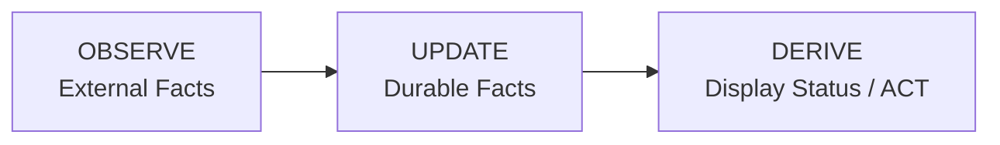

**Key insight:** Display status is never stored. It is computed at read time from durable facts.

### Durable Session Facts

Display status is derived from exactly these facts and nothing else:

- `activity_state` — What the agent last reported (`active`, `idle`, `waiting_input`, `blocked`, `exited`). `waiting_input` is an agent at an empty prompt awaiting its next instruction; `blocked` is an agent stopped on a pending permission/approval decision — automation must never inject input into a blocked session.
- `is_terminated` — Whether the session should be treated as over
- The runtime handle and launch generation for the session's terminal process
- PR facts — `pr`, `pr_checks`, `pr_comment` tables

The session row carries other durable facts that are *not* status inputs — the
workspace and branch it owns, its diff base, its preview URL and revision, its
native agent session id and transcript path, the last user prompt and assistant
update, pinning, and cleanup generation. Observation output that a client
replays rather than derives lives in its own tables: `block_events` (the blocks
view), `transcript_offsets` (the tailer's cursor), `terminal_blocks` (durable
shell replay), and the `usage_*` family (token accounting).

The legacy `session_mode`, conversation, and interface-transition schema remains
temporarily so the dormant ACP packages compile. New sessions are always `tui`,
the pre-release reset removes legacy rows, and Phase 4 deletes that schema.

### What is NOT Durable

Display status like `working`, `needs_input`, `ci_failed`, `mergeable` are **computed at read time** by the service layer from the durable facts above.

---

## System Overview

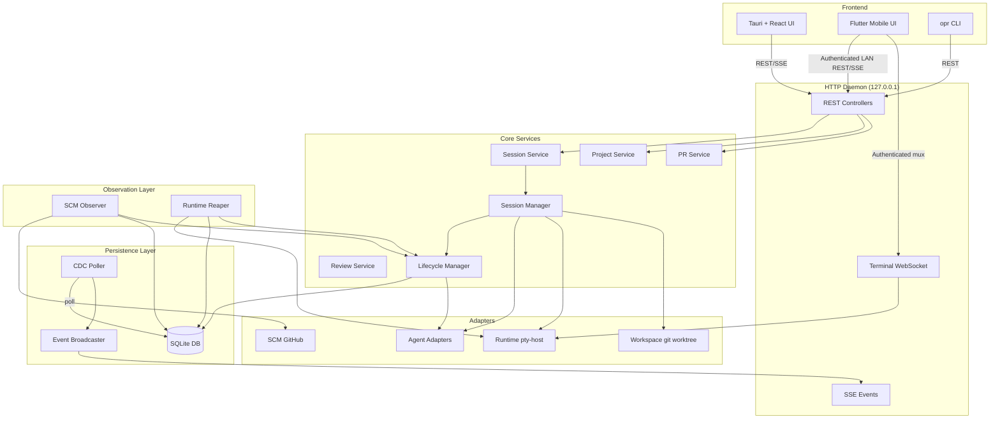

---

## Core Architectural Principles

### 1. Port-Based Design

Core code never depends on concrete implementations. All external systems are accessed through port interfaces defined in `backend/internal/ports/`:

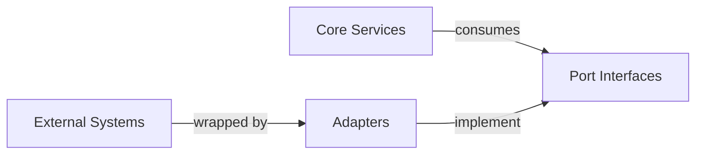

### 2. Durable Facts, Derived Status

Storage layer persists minimal facts. Service layer computes display status on-demand:

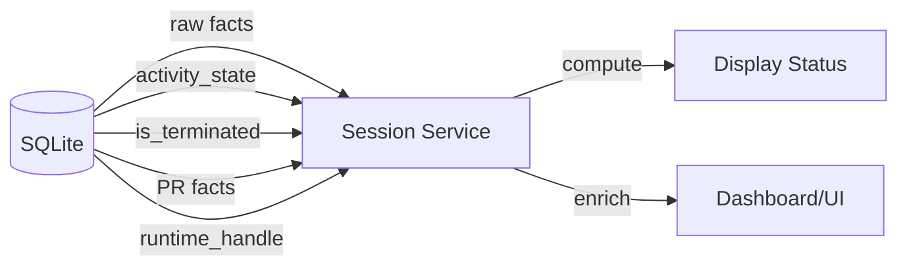

### 3. Observer Pattern

Observation is separated from action:

- **Observe layer** — SCM Observer, Runtime Reaper poll external state
- **Lifecycle layer** — Reduces observations into durable facts
- **Service layer** — Computes display status from facts

### 4. Change Data Capture

All durable changes flow through a CDC pipeline:

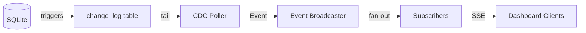

---

## Component Architecture

### Package Layout

```
backend/internal/
├── domain/              # Shared vocabulary and durable fact records
├── ports/               # Inbound/outbound interfaces
├── config/              # Environment-based configuration
├── daemon/              # Production wiring
├── cli/                 # Cobra `opr` commands, thin HTTP clients
├── service/             # Controller-facing services
│   ├── project/         # Project CRUD
│   ├── session/         # Session read-model assembly
│   ├── pr/              # PR observation service
│   ├── review/          # Code review service
│   ├── blockevent/      # Normalized block-event log, hook and transcript
│   ├── usage/           # Token and model usage accounting
│   ├── terminalblock/   # Durable shell-block replay
│   ├── terminalcapture/ # Capture supervisor
│   ├── shellterm/       # Standalone and session-scoped shells
│   ├── agent/           # Harness catalogue and model discovery
│   ├── settings/        # App settings
│   ├── notification/    # Desktop notification fan-out
│   ├── browser/         # agent-browser capability issuance
│   ├── importer/        # External session import
│   ├── devimport/       # Development import helpers
│   └── chat/            # Dormant until removal in Phase 4
├── session_manager/     # Internal session command engine
├── lifecycle/           # Durable session fact reducer
├── observe/             # Observation loops, one package per lane
│   ├── scm/             # GitHub PR, check and review observer
│   ├── reaper/          # Runtime liveness observer
│   ├── activity/        # Stale hook-activity reconciliation
│   ├── trackerintake/   # Opt-in issue intake
│   ├── usage/           # Provider transcript token accounting
│   └── transcript/      # Provider transcript to block events
├── storage/             # SQLite persistence
│   └── sqlite/          # DB, migrations, queries, generated stores
├── cdc/                 # Change-log poller and broadcaster
├── httpd/               # HTTP API, controllers, SSE, terminal mux
├── terminal/            # Terminal session protocol and mux
├── terminalcapture/     # pty-host capture journal
├── mobilebridge/        # LAN listener pairing and auth state
├── preview/             # Preview URL polling
├── previewserver/       # Preview serving
├── notify/              # Desktop notifications
├── push/                # Push registration
├── redact/              # Secret redaction, shared by every text channel
├── review/              # Review orchestration
├── reviewgateway/       # Reviewer process gateway
├── agentlaunch/         # Launch command assembly
├── process/             # Process spawning primitives
├── processalive/        # Liveness probes
├── sessionguard/        # Concurrency guards around session commands
├── workspacewatch/      # Worktree change watching
├── runfile/             # Daemon run-file and single-instance lock
├── daemonmeta/          # Daemon build and version metadata
├── telemetrymeta/       # Telemetry metadata
├── skillassets/         # Packaged skill assets
├── legacyimport/        # Legacy data import
├── devimport/           # Development import
├── integration/         # Cross-package integration tests
├── testsupport/         # Test-only helpers, including a real pty
└── adapters/            # Concrete adapter implementations
    ├── agent/           # 26 registered harnesses plus shared hook helpers
    ├── runtime/         # pty-host runtime
    ├── workspace/       # git worktree
    ├── scm/             # GitHub
    ├── tracker/         # GitHub tracker
    ├── agentbrowser/    # Packaged agent-browser runtime
    ├── reviewer/        # Reviewer harnesses
    ├── container/       # Container runtime
    ├── projectscan/     # Project discovery
    ├── telemetry/       # Telemetry sink
    └── chatdriver/      # Dormant until removal in Phase 4
```

The agent registry in `adapters/agent/registry/registry.go` is the single edit
point for a new harness. Packages under `adapters/agent/` that are not harnesses
— `blockdispatch`, `blocktranscript`, `activitydispatch`, `hookutil`,
`hooksjson`, `nativeconfig`, `modelcatalog`, `terminalui` — are shared mapping
tables the harness adapters consume.

### Core Data Flow

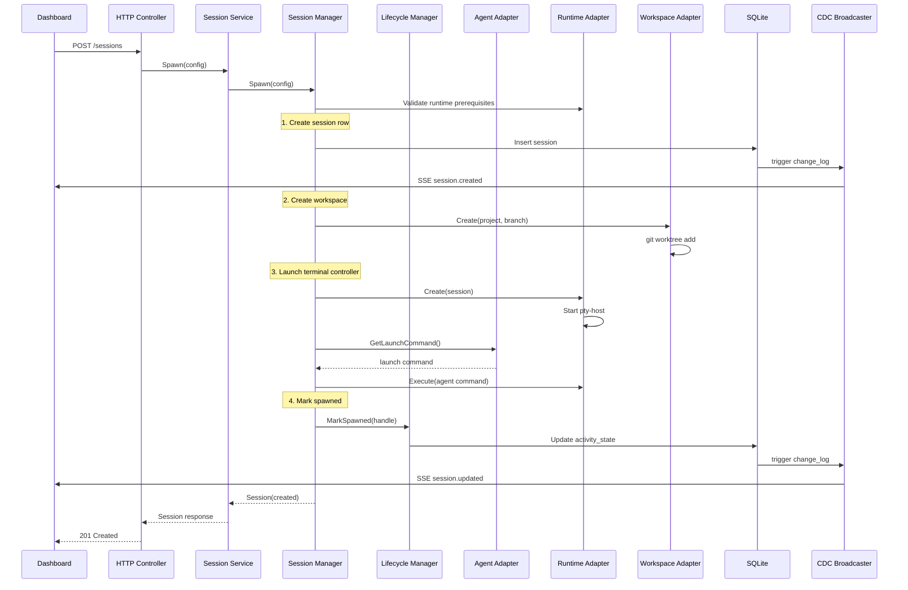

---

## Data Flows

### Session Spawn Flow

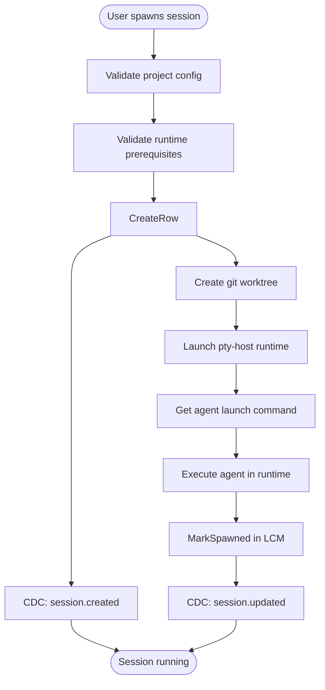

### Session Interface Handoff

Removed on 2026-09-04. Every session runs the agent's terminal UI and there is
no second controller to hand off to. The coordinator in
`session_manager/interface_transition.go` and its tables are unreachable and are
deleted in Phase 4 of
`docs/superpowers/specs/2026-09-04-single-session-interface-design.md`.

### Observation Flow

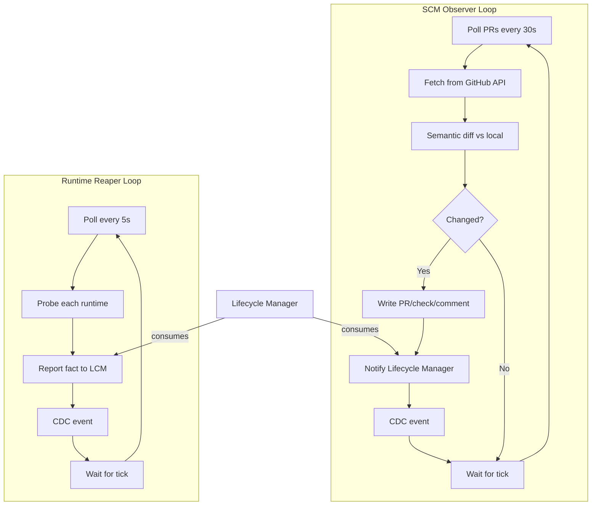

### Feedback Routing Flow

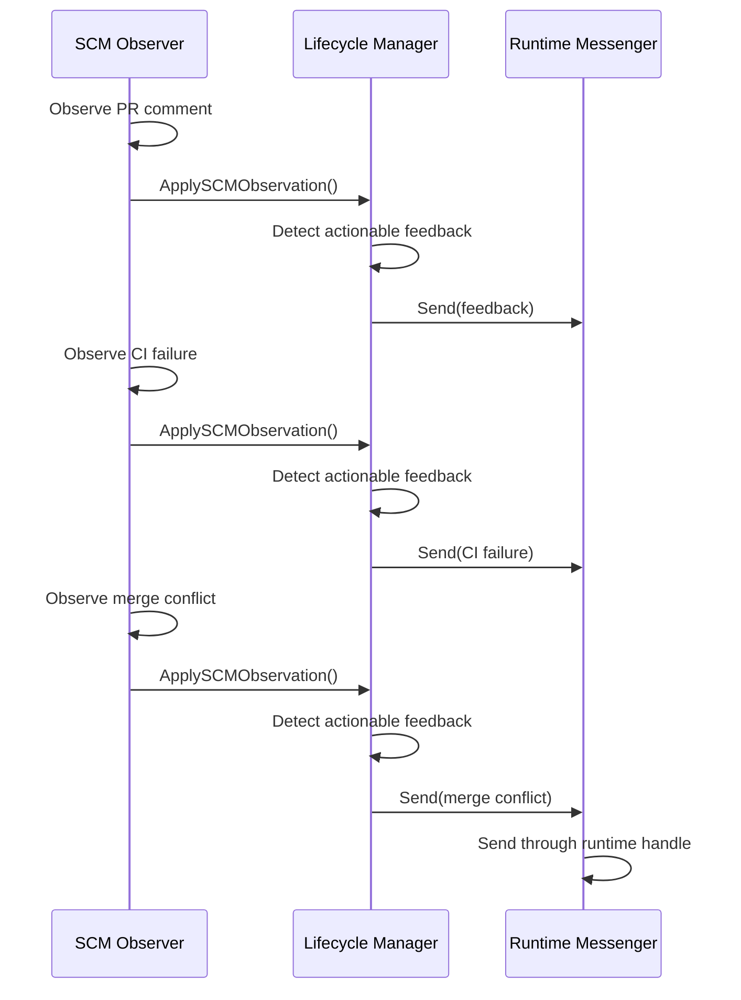

---

## Persistence and CDC

### SQLite Schema

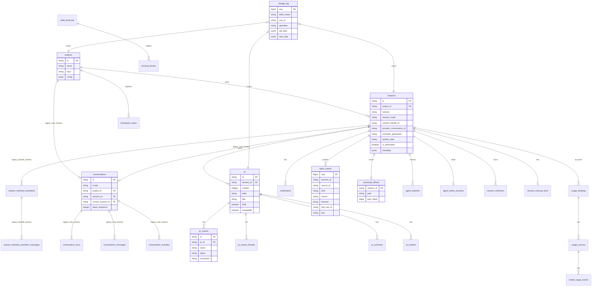

The diagram shows the load-bearing tables, not every table. `app_settings`,
`agent_model_catalog`, `review`/`review_run`, and `telemetry_event` are
standalone; the `conversations*` and `session_interface_*` families are the
dormant legacy schema Phase 4 deletes.

### CDC Pipeline

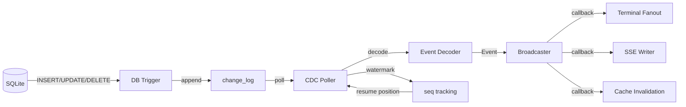

---

## Status Derivation

### Display Status Precedence

The `service.Session` computes display status from durable facts using this precedence (highest to lowest):

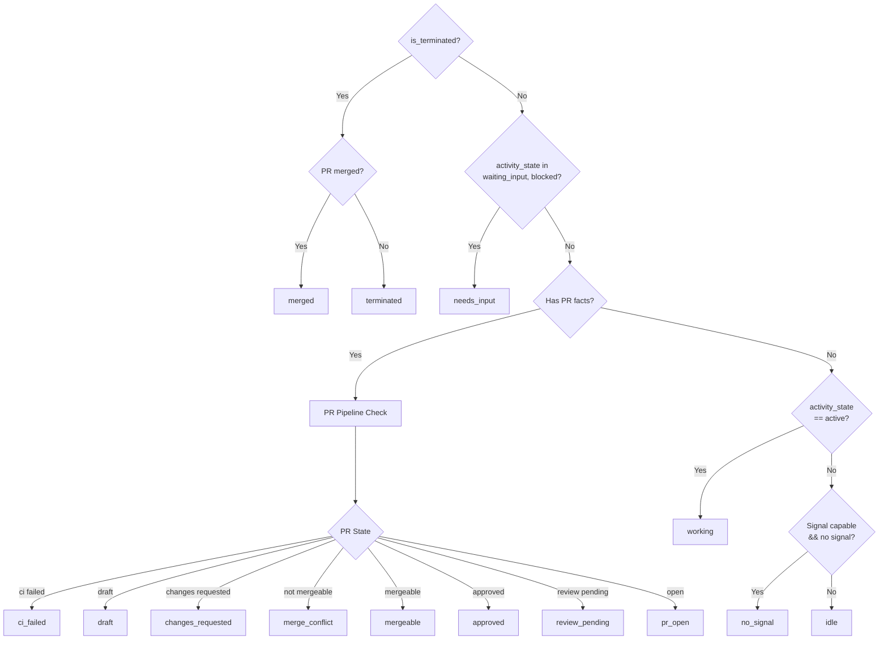

### PR Pipeline States

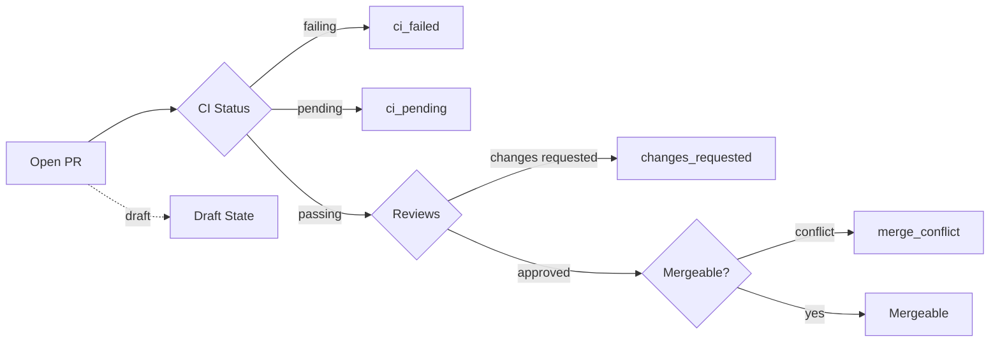

---

## Lifecycle Management

### Lifecycle Manager Responsibilities

The `lifecycle.Manager` is the **canonical write path** for all session lifecycle facts:

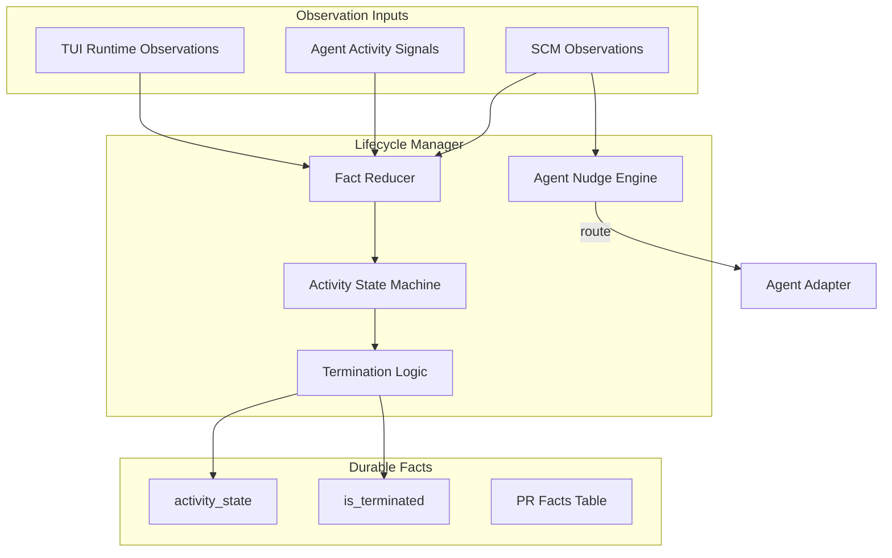

### Session State Machine

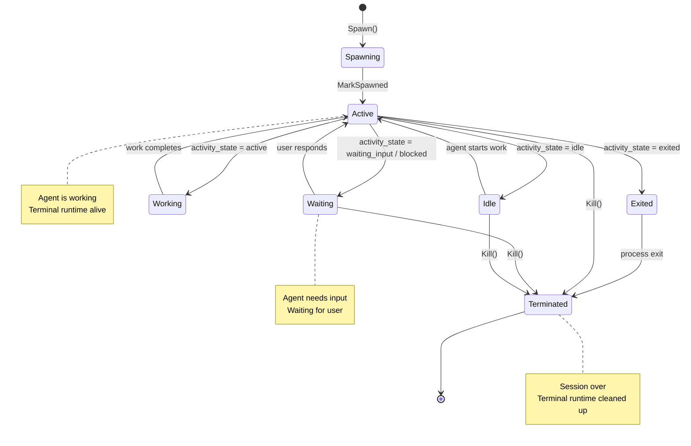

### Termination Guardrails

The lifecycle manager only terminates when **all** conditions are met:

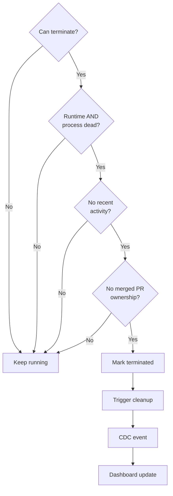

**Key principle:** Failed probes are NOT proof of death. A session is only terminated when the runtime and process are **both** clearly dead and recent activity doesn't contradict that.

---

## Observation Loops

Six independent lanes observe external state and reduce it into durable facts.
Each owns its own cadence and failure mode; none blocks another.

| lane | package | cadence | observes |
|---|---|---|---|
| SCM observer | `observe/scm` | 30s (reviews 2m) | GitHub PRs, checks, review threads, comments |
| Runtime reaper | `observe/reaper` | 5s | pty-host liveness for every non-terminated session |
| Activity observer | `observe/activity` | 30s | terminal markers, reconciling hook activity that went stale |
| Tracker intake | `observe/trackerintake` | opt-in per project | tracker issues eligible to start a worker session |
| Usage pipeline | `observe/usage` | fsnotify, 30s watcher restart | provider transcripts, for token and model accounting |
| Transcript projection | `observe/transcript` | fsnotify + 2s sweep | provider transcripts, for block-event body content |

The last two read the same files for unrelated reasons and share no state, on
purpose: usage accounting must not be able to break the blocks view, or the
reverse.

### SCM Observer

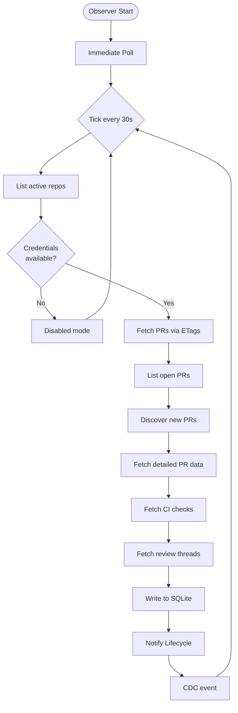

### Runtime Reaper

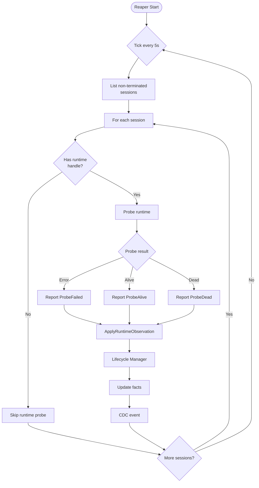

### Observation Integration

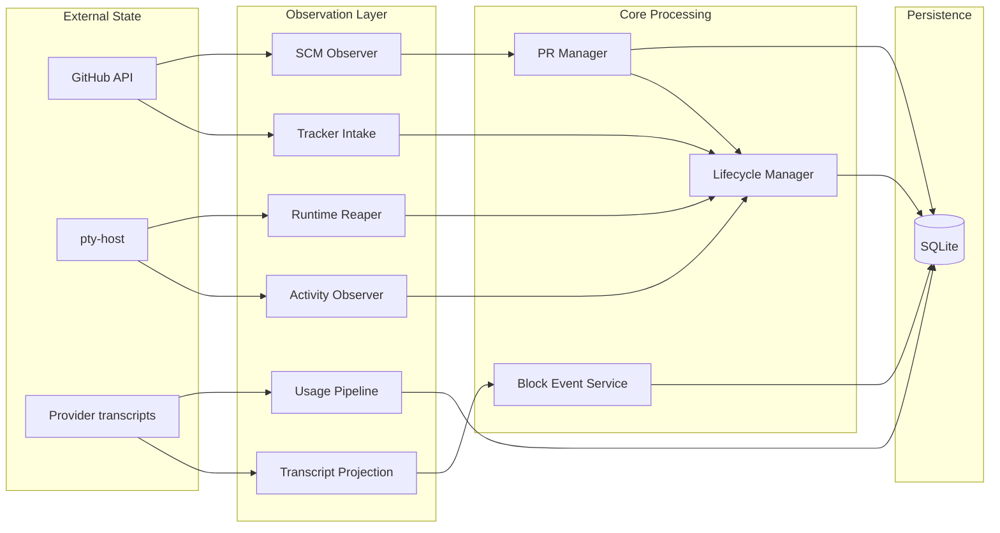

---

## HTTP Layer

### API Structure

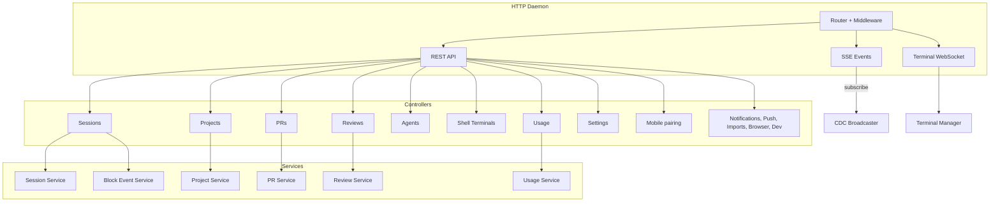

### Multi-Listener Architecture (Loopback + LAN)

The daemon runs two independent HTTP listeners sharing the same chi router:

1. **Primary (Loopback) Listener** — binds `127.0.0.1:3001` with no authentication. All existing daemon operations (CLI, desktop app) use this listener.
2. **LAN Listener** (Connect Mobile) — an opt-in second listener that binds `0.0.0.0:3011` (or ephemeral fallback) **only when explicitly enabled** by the user through the desktop app's Settings. It wraps the shared router in bearer-password authentication middleware, serves app API routes to mobile clients, but never exposes loopback-gated control routes (`/shutdown`, telemetry, mobile control commands). All traffic is plaintext HTTP on a home network only, by deliberate security decision — see `docs/adr/0001-lan-listener-for-mobile.md` for rationale and threat model. Auth state (hashed password, per-source lockout) is persisted to `~/.operator/mobile/config.json` and restored on daemon boot.

The mobile app is a second thin renderer over those same session resources. It
routes every session to the terminal screen, renders blocks for a covered harness
by default, merged from the hook channel and the daemon's transcript tailer, and
can attach the same mux PTY as a raw-terminal view. The per-session view choice
is stored only on the device. Session commands remain daemon operations; no
provider or lifecycle policy is implemented in the Flutter client.

For implementation details and security model, consult `docs/adr/0001-lan-listener-for-mobile.md` and the glossary in `CONTEXT.md`.

### Request Flow

```mermaid
sequenceDiagram
    participant Client
    participant Router
    participant Controller
    participant Service
    participant Manager
    participant Store
    participant DB

    Client->>Router: POST /api/v1/sessions
    Router->>Router: Middleware (auth, logging)
    Router->>Controller: handler(w, r)
    Controller->>Controller: decode JSON
    Controller->>Service: Spawn(config)
    Service->>Manager: Spawn(config)
    Manager->>Manager: Validate terminal runtime prerequisites
    Manager->>Store: Create session
    Store->>DB: INSERT INTO sessions
    DB->>Store: session record
    Store->>Manager: session record
    Manager->>Manager: Create and provision workspace
    Manager->>Manager: Launch terminal runtime/controller
    Manager->>Service: Session response
    Service->>Controller: enriched session
    Controller->>Controller: encode JSON
    Controller->>Client: 201 Created + Session
```

---

## Terminal Multiplexing

The mux carries every session's agent terminal and any session-scoped worktree
shells. The agent terminal is the only live agent controller.

### Transcript block projection

`internal/observe/transcript` runs one tail per live session whose harness has a
mapper in `adapters/agent/blocktranscript` (Claude Code and Codex today). It
resolves the session's provider transcript from the hook-reported path first and
the adapter's own `AgentTranscriptLocator` as a fallback, rejecting any path
outside that provider's config directory, reads new complete JSONL lines from a
cursor persisted in `transcript_offsets`, and records each mapped record through
the same `blockevent.Service` a hook uses — same redaction, same caps, same mux
publish — marked `source = transcript`. It shares no state with the usage
observer, which reads the same files on its own cursor for unrelated reasons. An
unrecognised record type produces nothing and is counted, so a harness upgrade
degrades to fewer blocks rather than to a crash.

The filesystem watch is a latency optimisation, not a dependency: a watch that
cannot be built costs a couple of seconds per record, never a block. A session
that ends is drained once more before its tail is dropped, so the agent's last
words are projected; a session whose transcript has not appeared yet is
re-resolved on a backoff, because Codex's fallback resolution walks its whole
sessions tree.

### Durable shell-block capture

Each eligible standalone shell has one capture writer, tee'd off the pty-host's
own output path after the client broadcast so it can never delay a byte reaching the
screen. It writes an epoch-scoped journal below the Operator data root: one active 1 MiB segment and at most eight sealed segments. Before
pruning unread data it records a gap. The reader never rotates or truncates the journal;
after a gap it abandons the partial block and resumes at the next valid prompt. The
alternate-screen flag intentionally remains unchanged across a gap, favoring suppression
of possible TUI repaint bytes over an unsafe reset.

The capture supervisor serializes start/stop per terminal handle, queries capture and
alternate-screen state, and adopts live writers after daemon restart. On an explicit
close it stops and seals the writer, drains and persists final data, then lets runtime
destruction proceed. On graceful daemon shutdown it drains and detaches but leaves live
writers running for restart adoption. Raw replay blocks and their cursor metadata live in
`terminal_blocks`, keyed by terminal handle; `GET /api/v1/shell-terminals/{handleId}/blocks`
returns chronological history. The store retains the newest 100 blocks per terminal and
5,000 output lines per block, with an additional 8 MiB raw-byte safety cap. Capture is
part of the pty-host, so it behaves the same on every platform; `durableBlocks` reports
whether a given handle is actually being captured, not which OS it runs on.

### Terminal Architecture

```mermaid
flowchart TD
    subgraph Frontend
        Browser[Browser Terminal]
    end

    subgraph HTTPD
        WS[WebSocket Handler]
    end

    subgraph Terminal
        Mux[Terminal Mux]
        Sessions[Session States]
    end

    subgraph Runtime
        PtyHost[pty-host Runtime]
    end

    Browser -->|WebSocket| WS
    WS -->|attach| Mux
    Mux --> Sessions
    Sessions -->|create| PtyHost

    PtyHost -->|loopback dial| Mux

    Mux -->|frame| WS
    WS -->|binary| Browser

```

### Attach Flow

```mermaid
sequenceDiagram
    participant Client as Browser
    participant WS as WebSocket Handler
    participant Mux as Terminal Mux
    participant Runtime as pty-host

    Client->>WS: WebSocket upgrade
    WS->>Mux: Attach(session, rows, cols)
    Mux->>Runtime: Attach(handle, rows, cols)

    Runtime->>Runtime: Create PTY
    Runtime->>Runtime: Dial the session's pty-host

    loop Data Loop
        Runtime->>Mux: PTY output
        Mux->>WS: Binary frame
        WS->>Client: WebSocket message

        Client->>WS: User input
        WS->>Mux: Input frame
        Mux->>Runtime: Write to PTY
    end

    Client->>WS: Close
    WS->>Mux: Detach
    Mux->>Runtime: Close PTY
```

## Standalone Browser Runtime

Browser automation is owned by the Go daemon through the packaged `agent-browser`
binary (`backend/internal/adapters/agentbrowser/`): discovery, per-session runtime
state, command policy, and execution. Each session gets its own isolated Chromium
profile under the operator state root; the daemon's policy layer allowlists a
closed set of commands and blocks flags that would escape that isolation — CDP
attach, auto-connect, profile/state reuse, custom executables, extensions,
init scripts, proxies. The runtime never attaches to the user's own browser
profile, and the embedded in-window browser panel was removed with the Tauri port:
previews open in the user's default browser (see
`docs/todo/browser-panel-webview.md` for the deferred panel record).

The session-facing entry point is the `opr browser` CLI (`backend/internal/cli/browser.go`),
which routes through the daemon so capability issuance stays server-side.

Panel-only capabilities were dropped with the Electron panel: DevTools control and
request/network capture have no standalone implementation — the adapter rejects
them with stable error codes (`BROWSER_DEVTOOLS_UNAVAILABLE`,
`BROWSER_AUTOMATION_UNAVAILABLE`) instead of approximating them. Ending the
session discards the isolated per-session state.

---

## Load-Bearing Rules

These rules are **load-bearing** — changing them breaks fundamental architectural assumptions:

1. **Never store display status** — Status is derived from durable facts at read time
2. **Never treat failed probes as death** — A failed probe is a fact, not a termination signal
3. **Never force-delete dirty worktrees** — User data safety over cleanup convenience
4. **All app state under ~/.operator** — No OS-default app-data locations
5. **One loopback listener, one opt-in LAN listener, nothing else** — the primary listener stays bound to `127.0.0.1` and unauthenticated; the LAN listener binds `0.0.0.0` only while the user has explicitly enabled Connect Mobile, only behind the bearer-password middleware, and never serves the loopback-gated control routes. No other network-facing bind
6. **CLI is thin** — All logic lives in the daemon, CLI is just an HTTP client
7. **CDC is source-truth for events** — DB triggers write to change_log, poller fans out
8. **Adapters are leaves** — Adapters never import core packages, only ports and domain
9. **Hooks are gitignored** — Every file an adapter writes must be in .gitignore
10. **Migrations never change** — Add new migrations, never modify existing ones

---

## Summary

Operator's architecture is designed around:

- **Separation of concerns** — Observation, persistence, and display are distinct layers
- **Port-based design** — Core code depends on interfaces, not implementations
- **Durable minimalism** — Store only facts, compute everything else
- **Event-driven updates** — CDC broadcasts changes to all subscribers
- **Isolation** — Each session owns a worktree and exactly one live controller: its agent terminal
- **Safety** — Conservative termination, path validation, gitignored hooks

This architecture enables parallel AI agents to work safely while maintaining complete visibility and control.
