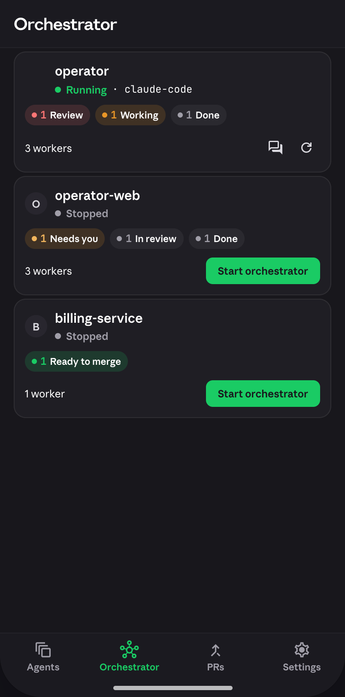
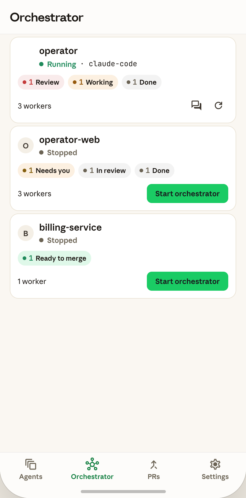

# Orchestrator screen

 · 

Shared docs: [`../README.md`](../README.md) · [`../colors.md`](../colors.md) ·
[`../typography.md`](../typography.md) · [`../motion.md`](../motion.md) ·
[`../components.md`](../components.md)

## Part A — Spec

### Purpose

Second tab (`tab1`) of the 4-tab home shell. Lists every project that can run an
orchestrator process, its running/stopped state, a breakdown of its workers' attention
zones, and a way to start/restart/open it. Reached by tapping "Orchestrator" in the
bottom nav; no loading/empty states are modeled in the prototype (always shows the full
project list — treat an empty-projects case as out of scope for this pass, matching
`sessions_board.md`'s Empty-state pattern only if the user asks for one later).

### Layout tree (top → bottom)

```
Scaffold (bg: skin.bgBase)
  Appbar (S.appbarMain: minHeight 56, padding 0 16, bg skin.bgChrome,
          bottom border 1px skin.borderSubtle)
    Title "Orchestrator" (style19SemiBold-equivalent but DISPLAY family, letterSpacing -0.3)
  Body (S.tabBody: flex:1, scroll, paddingBottom 40)
    for each project → ProjectCard (radiusCard=14, bgSurface, 1px borderDefault,
                                     padding 12, margin '4px 16px', staggered entrance)
      Row: avatar (26×26) + name/status column + spacer
      Row: attention-zone pill row (wraps, gap 6, marginTop 10)
      Row: workers text + spacer + action icons/button (marginTop 10)
  BottomNav (S.bottomNav: bg skin.bgChrome, top border 1px skin.borderSubtle,
             paddingBottom 22) — see "Bottom nav" below, shared by tabs 0-3
```

### Per-element specs

**Appbar title** — `style19SemiBold`-equivalent size (19px) but rendered in the
**Display** family (`AppTextStyle._displayStyle` — see typography.md), `textPrimary`,
letterSpacing -0.3. *(Note: this is the one appbar in the app whose title uses the
Display family — cross-check against sessions_board/settings/pull_requests appbars,
which the source shows using the same `S.appbarTitle` key, so this treatment is shared
across all 4 tabs, not orchestrator-specific.)*

**Project card** (`radiusCard`, `bgSurface`, 1px `borderDefault`, padding 12, margin
`4px 16px`, staggered fade-up entrance per `AppMotion.staggerDelay(index)`):
- Top row (`cardTopRow`: flex row, gap 9):
  - Avatar 26×26: if the project's harness is a known logo key (`claude-code`, `cursor`,
    `codex`, `copilot`, `devin`, `goose`, `kimi`) → `radiusXs`(6)-rounded image tile,
    `contain`/`center`/no-repeat; else a circular (`radiusPill`) `bgElevated` tile showing
    the project name's first letter, uppercased, `textSecondary`, 12px SemiBold Anthropic
    Sans Text.
  - Name/status column (flex:1): project name (15px SemiBold, `textPrimary`, 4px bottom
    margin) then a status row (flex, gap 6): a 7×7 circular dot (color below) + status
    label (12px SemiBold, same color) + optional " · {harness}" in 12px Regular **mono**
    (`textPrimary`) when the project has a harness.
  - Status color/label: `restarting` → `amber`/"Restarting…"; else `running` →
    `green`/"Running"; else `textTertiary`/"Stopped".
- Attention-zone pill row (`pillRow`: flex wrap, gap 6, marginTop 10) — one pill per
  non-zero attention zone among the project's *workers* (sessions belonging to that
  project), in `ZONE_ORDER` order (`merge`, `respond`→"Needs you", `review`, `pending`,
  `working`, `done`): each pill is a `radiusPill` chip, padding `4px 8px`, background =
  that zone's *tint* color, containing a 6×6 dot (zone's solid color) + count in 12px
  Bold **mono** (zone color) + the zone's label in 11px SemiBold `textPrimary`.
  Zone → label/color comes from `ATTENTION_META(skin)`: merge→"Ready to merge"/`green`;
  respond→"Needs you"/`amber`; review→"Review"/`red`; pending→"In review"/`textTertiary`;
  working→"Working"/`orange`; done→"Done"/`textTertiary`.
- Bottom row (`orchBottomRow`: flex, gap 4, marginTop 10): "{n} worker(s)" text (use
  existing body style, `textPrimary`) + spacer + action controls:
  - If running: a 32×32 icon button (forum icon = "open chat/session") + a 32×32 icon
    button (refresh icon = "restart"), both `textSecondary`, no background.
  - If not running: a "Start orchestrator" pill button — 12px SemiBold `onAccent` text on
    `accent` background, `radiusMd`(8), padding `8px 14px`.

### Sheets & dialogs owned by this screen

None. No sheet/dialog is opened from the Orchestrator tab in the prototype.

### Dummy content (verbatim)

Three projects, `PROJECTS` array + live session data cross-referenced by `project` field:

| id | name | harness | running | workers → zones (from `SESSIONS`) |
|---|---|---|---|---|
| `operator` | operator | claude-code | true (shown "Running") | 3 workers → 1 Review (s3 ci_failed), 1 Working (s1 working), 1 Done (s6 done) |
| `operator-web` | operator-web | — | false (shown "Stopped") | 3 workers → 1 Needs you (s2 needs_input), 1 In review (s5 pr_open), 1 Done (s9 merged→done zone... verify: merged status maps to `attentionOf`→'done') |
| `billing-service` | billing-service | — | false ("Stopped") | 1 worker → 1 Ready to merge (s4 mergeable) |

Avatar: `operator` has the `claude-code` logo image; `operator-web`/`billing-service` show
"O"/"B" letter avatars (no known harness).

### Motion

Cards fade-up + stagger in on mount (`AppMotion.staggerDelay(index)`, `AppMotion.slow`,
`AppMotion.easeOut`) — no other per-element animation on this screen (no breathing dots
here; `StatusDot`'s breathing variant is a Sessions-board-only treatment per the source —
this screen's dot is static).

### Verified behaviors

- Tapping a running project's forum icon → **opens screen 7 (session detail)** for that
  project's first worker session. Per README's flagged conflict, this ultimately routes
  through `SessionRouteScreen` → `TerminalScreen`, not a chat UI.
- Tapping refresh → `restartOrchestrator(projectId)` (sets a transient "Restarting…"
  state — exact duration not specified in source; use a reasonable placeholder, e.g. 1-2s,
  until wired to a real repository call).
- Tapping "Start orchestrator" → `startOrchestrator(projectId)`.
- No pull-to-refresh interaction is defined in source for this tab specifically (the
  vendored `expressive_refresh_indicator` noted in components.md is a candidate for a
  later pass, not required here).

### Flutter mapping

- Feature dir: `lib/feature/orchestrator/presentation/orchestrator_screen/`.
- Core widgets consumed: `AppContainer`/card equivalent (`radiusCard`), `StatusDot`
  (non-breathing mode — confirm `StatusDot` supports a static variant, or just use a
  plain colored `Container` circle if it doesn't, per components.md's actual API),
  `AppPill`/chip primitive for the zone pills, `PrimaryButton`-style small variant or a
  bespoke small pill button for "Start orchestrator" (check if `PrimaryButton` supports a
  compact/inline size — components.md documents a `fixedSize` sheet/dialog variant at
  height 46; this control is smaller still (`8px 14px` padding, no fixed height) so it
  may need a new small-button variant or a plain `PressScale`-wrapped container).
- Custom feature widgets: the project card itself (avatar/status/pills/actions
  composition) — likely `orchestrator_screen/ui/widgets/orchestrator_project_card.dart`.

## Part B — Implementation brief

# TASK: Build the Orchestrator tab UI (screen 4/8) matching the design prototype.
Phase scope: **UI-only — dummy data, no backend.** Wire to real
`lib/feature/orchestrator/data/repository/` calls in a later pass.

**Do this FIRST, before any Dart:**
1. Read `docs/design/README.md` (screen→feature map, global conventions, "already
   implemented — don't recreate" inventory) in full.
2. Invoke the `/flutter-knowledge` skill — authority on this project's feature tree,
   Cubit conventions, screen/body split, DI, and routing. Only then proceed.
3. Read the Part A spec above, the two PNGs in this dir, and `../colors.md` /
   `../typography.md` / `../motion.md` / `../components.md`.

**Target feature — exact path (non-negotiable):**
`lib/feature/orchestrator/presentation/orchestrator_screen/` (from README's screen→feature
map, row 4). Every file for this screen goes here and nowhere else.

**Already exists — do NOT recreate:** `lib/feature/orchestrator/presentation/
orchestrator_screen/{ui,logic}` directories already exist — read what's there first
(`Read`/`Glob`) before adding files; extend/restyle rather than duplicate if a cubit or
screen file already exists. Core widgets (buttons, containers, skin, motion, text
styles) are all Phase 2-5 complete — consume them, don't rebuild.

**Files to create/change** (exact names may differ if something already exists — check
first): `ui/orchestrator_screen.dart` (screen/body split per flutter-knowledge
convention), `ui/widgets/orchestrator_project_card.dart`, cubit/state part files under
`logic/` if not already present, with dummy `PROJECTS`-shaped data per Part A's table
above until the real repository is wired.

**Key implementation points:**
1. Zone-pill order and color/label mapping must match `ATTENTION_META` exactly — port it
   as a Dart enum/map, don't inline switch statements per widget.
2. The appbar title uses the **Display** text style (`AppTextStyle.style19...` — actually
   check components.md/typography.md for the exact 19px Display getter name; if it
   doesn't exist yet, this is a small gap in Phase 3 — add it there, don't invent an
   ad-hoc `TextStyle` inline).
3. "Start orchestrator" button size doesn't match any existing `PrimaryButton` variant
   (see Part A's Flutter-mapping note) — resolve with a small/compact button variant
   rather than a one-off inline `Container`.
4. Card avatar falls back to a letter-in-circle when no known harness logo exists —
   reuse whatever avatar-fallback logic the Sessions-board screen implements (built in
   parallel; check for a shared `AvatarTile` widget before writing a second one).

**Dummy data:** verbatim table in Part A above.

**Localization:** this repo's CLAUDE.md is explicit — **no LocaleKeys/easy_localization**,
user-facing copy is inline English. Do not add translation keys for this screen's text.

**Definition of done:** `flutter analyze` clean; screen matches both PNGs (light + dark);
tapping "Start orchestrator"/refresh/forum icons calls the right (stubbed) handler;
zone pills render in `ZONE_ORDER`; no LocaleKeys added; files only under the target
feature path above.
