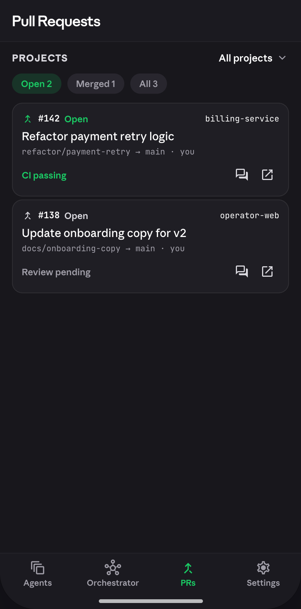
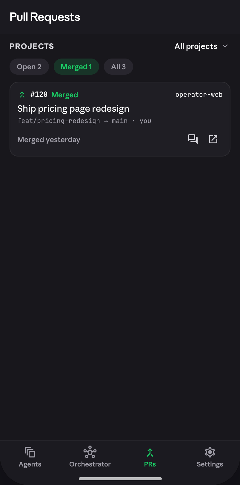
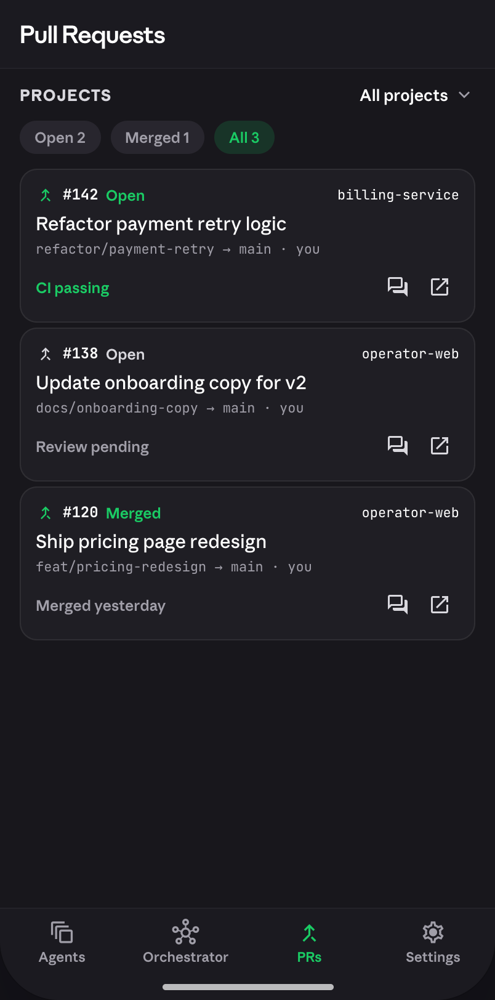

# Pull Requests screen

 ·  · 

Shared docs: [`../README.md`](../README.md) · [`../colors.md`](../colors.md) ·
[`../typography.md`](../typography.md) · [`../motion.md`](../motion.md) ·
[`../components.md`](../components.md)

## Part A — Spec

### Purpose

Third tab (`tab2`) of the 4-tab home shell. Lists pull requests across (or scoped to) the
active project, filterable by Open/Merged/All. Reached by tapping "PRs" in the bottom nav.

### Layout tree (top → bottom)

```
Scaffold (bg: skin.bgBase)
  Appbar (S.appbarMain — identical spec to Orchestrator's, see that doc)
    Title "Pull Requests" (Display family, 19px, textPrimary, letterSpacing -0.3)
  Body (S.tabBody: flex:1, scroll, paddingBottom 40)
    Project switcher row (S.projectSwitcherRow: flex space-between, padding '12px 16px 4px')
      "PROJECTS" label (13px Bold, textSecondary, letterSpacing 0.8) — left
      Active-project row (flex, gap 4, cursor pointer) — right: "All projects" (13px
        SemiBold, textPrimary) + expand_more chevron icon
    Filter pill row (S.pillFilterRow: flex, gap 8, padding '8px 16px')
      3 pills: "Open {n}", "Merged {n}", "All {n}"
    for each filtered PR → PrCard (radiusCard=14, bgSurface, 1px borderDefault,
                                    padding 12, margin '4px 16px', staggered entrance)
  BottomNav — shared spec, see Orchestrator doc
```

### Per-element specs

**Project switcher row.** The "All projects ˅" control on the right is a tap target
(cursor:pointer in source) but **no handler is wired in the prototype** — it's visually
present with no `sc-camel-on-click`. This repo already has `lib/core/widgets/pickers/
project_switcher.dart` (restyled in Phase 5) — wire this row to open that existing picker
rather than building a new one; treat the prototype's missing handler as an oversight to
fix, not a spec to replicate literally.

**Filter pills** (`pillStyle(active)`): padding `6px 12px`, `radiusPill`, 12px SemiBold.
Active: background `tintGreen`, text color = "brand ink" (`accent` in dark mode, the
literal `#117E3F` in light mode — see components.md's "Chip active text color" judgment
call, this is the SAME active-state logic already implemented for `AppPill`, reuse it,
don't reintroduce a second brand-ink constant). Inactive: background `bgElevated`, text
`textTertiary`, **no border**. Default filter on screen entry is **"Open"**.

Note `pillStyle` is NOT identical to the sessions board's `agentChip` (both share the
active/tint/brand-ink logic, but `agentChip`'s inactive state is a bordered `bgSurface`
chip at 12.5px/`textSecondary`, while `pillStyle`'s inactive state is borderless
`bgElevated` at 12px/`textTertiary` — padding also differs, `7px 12px` vs `6px 12px`).
`AppPill` takes a `dense` flag for this: pass `dense: true` for the PR filter row to get
the `pillStyle` variant; the sessions board's filter row keeps `dense: false` (default)
for `agentChip`.

**PR card** (`radiusCard`, `bgSurface`, 1px `borderDefault`, padding 12, margin
`4px 16px`, staggered entrance):
- Top row (`prTopRow`: flex, gap 6): merge-icon (`call_merge`, 16px, colored per state
  below) + "#{number}" (12px Bold mono, `textPrimary`) + state label (12px SemiBold,
  colored per state) + spacer + repo name (11px Regular mono, `textPrimary`).
- Title (15px Medium, `textPrimary`, margin `6px 0 4px`).
- Meta line (11px Regular mono, `textTertiary`, marginBottom 8) — e.g.
  "refactor/payment-retry → main · you".
- Bottom row (`prBottomRow`: flex, gap 2): "atom" status text (12px SemiBold, colored per
  state) + spacer + two 32×32 icon buttons: forum (open chat) and open_in_new (external
  link — no handler wired in source; treat as a future "open in browser" action).

**State → color/label** (from `prSource`, hardcoded per PR in the mock, not derived from
a generic status enum the way sessions/orchestrator are):
| life | merge-icon & state-label color | atom text | atom color |
|---|---|---|---|
| open, CI passing | `green` | "CI passing" | `green` |
| open, review pending | `textSecondary` | "Review pending" | `textTertiary` |
| merged | `green` | "Merged yesterday" | `textTertiary` |

Note this is per-PR hardcoded tone in the mock, not a single life→color function — when
wiring real data, derive a proper `life`/CI-state → color mapping rather than hardcoding
three cases; document your derived mapping in code, don't silently invent one un-noted.

### Sheets & dialogs owned by this screen

None directly opened from this screen in the prototype (the project-switcher's picker is
an *existing shared* core widget per the note above, not a new sheet owned by this
screen).

### Dummy content (verbatim)

```
#142  Open       billing-service   "Refactor payment retry logic"
      refactor/payment-retry → main · you        CI passing
#138  Open       operator-web      "Update onboarding copy for v2"
      docs/onboarding-copy → main · you           Review pending
#120  Merged     operator-web      "Ship pricing page redesign"
      feat/pricing-redesign → main · you          Merged yesterday
```
Counts: Open 2, Merged 1, All 3.

### Motion

Cards fade-up + stagger on mount/filter-change (`AppMotion.staggerDelay(index)`,
`AppMotion.slow`, `AppMotion.easeOut`) — verified: switching filters in the prototype
re-triggers the stagger entrance for the newly-filtered list (each filter change re-maps
`prEntries` with fresh `enter(pi)` calls, i.e. it re-animates every time, not just on
first mount).

### Verified behaviors

- Tapping a filter pill sets `prFilter` and re-filters the list (verified via screenshot
  walk: Open → Merged → All, each showing the correct subset and pill counts).
- Tapping a PR card's forum icon → **opens screen 7 (session detail)** for that PR's
  associated session (`p.sessionId`). Same terminal-vs-chat conflict flagged in README
  applies here.
- open_in_new icon and the project-switcher row have no wired handler in the source (see
  notes above) — implement open_in_new as a placeholder (no-op or a "coming soon" toast
  via `AppToast`) until a real external-link target exists.

### Flutter mapping

- Feature dir: `lib/feature/pull_request/presentation/pull_requests_screen/`.
- Core widgets consumed: card container (`radiusCard`), `AppPill` filter chips with
  `dense: true` (the `pillStyle` variant — see note above, do not duplicate the
  active/brand-ink logic), existing `lib/core/widgets/pickers/project_switcher.dart` for
  the project switcher row, `AppToast` for the open_in_new placeholder.
- Custom feature widgets: PR card composition, e.g.
  `pull_requests_screen/ui/widgets/pull_request_card.dart`.

## Part B — Implementation brief

# TASK: Build the Pull Requests tab UI (screen 5/8) matching the design prototype.
Phase scope: **UI-only — dummy data, no backend.**

**Do this FIRST, before any Dart:**
1. Read `docs/design/README.md` in full (screen→feature map, global conventions,
   don't-recreate inventory).
2. Invoke the `/flutter-knowledge` skill — authority on feature tree, Cubit conventions,
   screen/body split, DI, routing.
3. Read the Part A spec above, the 3 PNGs in this dir, and the shared design docs.

**Target feature — exact path (non-negotiable):**
`lib/feature/pull_request/presentation/pull_requests_screen/` (README row 5). Every file
for this screen goes here and nowhere else.

**Already exists — do NOT recreate:** `lib/feature/pull_request/presentation/
pull_requests_screen/{ui,logic}` directories already exist — read what's there first.
`lib/core/widgets/pickers/project_switcher.dart` already exists (Phase 5-restyled) — wire
the project-switcher row to it, don't build a second picker. `AppPill`'s active/inactive +
brand-ink color logic already exists in `main_widgets/app_pill.dart` — reuse it for the
filter pills via the `dense: true` (`pillStyle`) variant, don't reimplement the light-mode
`#117E3F` special case a second time.

**Files to create/change:** `ui/pull_requests_screen.dart` (screen/body split),
`ui/widgets/pull_request_card.dart`, filter-state handling in the existing/new cubit under
`logic/`, dummy data shaped per Part A's table until the real repository is wired.

**Key implementation points:**
1. Default filter on screen load is "Open", not "All".
2. Filter pills re-trigger the staggered entrance animation on every filter change, not
   just first mount — don't gate the stagger animation to "first build only".
3. Per-PR color/label is presently hardcoded per dummy PR in the mock, not derived from a
   single status enum — when wiring real PR data later, design a proper CI-state → color
   mapping (document it in code); don't hardcode three cases against real data.
4. open_in_new icon and the "All projects ˅" row have no wired behavior in the source —
   implement the former as an `AppToast` placeholder and the latter routed to the
   existing `project_switcher.dart` picker (a real behavior, not a placeholder, since the
   widget already exists and this is clearly its intended purpose).

**Dummy data:** verbatim block in Part A above.

**Localization:** this repo's CLAUDE.md is explicit — **no LocaleKeys/easy_localization**,
user-facing copy is inline English. Do not add translation keys for this screen's text.

**Definition of done:** `flutter analyze` clean; screen matches all 3 PNGs (Open/Merged/
All, dark); filter switching re-animates the list and updates counts; project-switcher row
opens the existing picker; files only under the target feature path above; no LocaleKeys
added.
