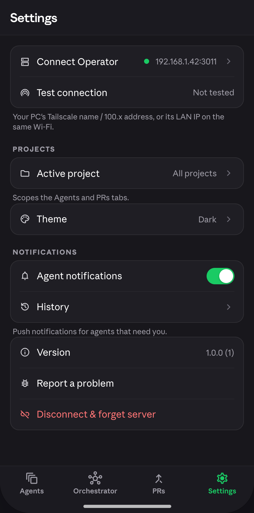
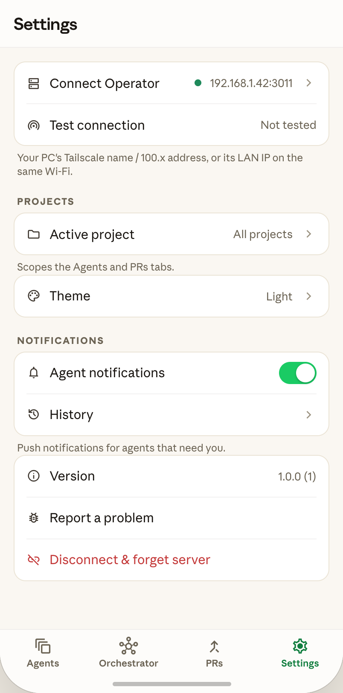

# Settings screen

 

Shared docs: [`../colors.md`](../colors.md) · [`../typography.md`](../typography.md) ·
[`../motion.md`](../motion.md) · [`../components.md`](../components.md) ·
[`../README.md`](../README.md) (screen→feature map, global conventions).

## Part A — Spec

### Purpose / context

Fourth tab of the bottom-nav home shell. Surfaces the current daemon connection, active
project scope, theme, notification prefs, and app/version info, plus the destructive
"disconnect" action. No sheets or dialogs are opened directly from this screen in the
prototype (verified — every row either navigates, toggles inline, or is inert placeholder
text; "Report a problem" has no `sc-camel-on-click` at all).

### Bottom nav bar (shared chrome — document once, here)

This is `lib/core/app_routes/home_shell.dart` chrome, not owned by Settings or any single
feature — Sessions/Orchestrator/Pull-Requests screens should reference this section rather
than respeccing it.

- Container: `S.bottomNav` — fixed at the bottom of the home shell, above the safe-area
  inset (use `SafeArea`, not a literal padding).
- 4 items, icon above label, evenly spaced: `auto_awesome_motion` "Agents" (Material Symbols
  ligature name → map to whatever icon set `components.md`'s icon reconciliation lands on),
  `hub` "Orchestrator", `call_merge` "PRs", `settings` "Settings".
- Active tab: icon + label tinted `accent`. Inactive: `textTertiary`.
- Tap navigates instantly — no page-transition per README's global convention.

### Layout tree (top → bottom)

1. **Appbar** (`S.appbarMain`): `bgChrome` background, `borderSubtle` bottom border, min-height
   56, horizontal padding 16. Title "Settings", `style19SemiBold` with `Anthropic Sans
   Display` family (per `S.appbarTitle`'s `fontFamily:DISPLAY`), letter-spacing -0.3.
2. **Scrollable body** (`S.tabBody`): bottom padding 40.
3. **Top group** (`S.settingsGroupTop` — `bgSurface`, `radiusCard`, `borderDefault` 1px,
   margin `16px 16px 0`, clipped corners):
   - "Connect Operator" row: `dns` icon (`textSecondary`, size 17), label "Connect Operator"
     (`rowLabel` — `style15Regular`/`textPrimary`), flex spacer, an 8×8 circular status dot
     (`connDot` — `green` fill, always green in the mockup, no offline state modeled),
     value "192.168.1.42:3011" (`rowValue` — `style13Regular`/`textTertiary`,
     monospace-looking but actually still the sans `t()` helper, not `m()` — do NOT use a
     mono style getter here), trailing `chevron_right` (`textFaint`... actually chevron
     uses the same icon color as other chevrons, `textSecondary`-ish per `I.chevron` — see
     components.md's icon inventory). Row height: `settingsRow` = min-height 48, padding
     `8px 14px`.
   - `rowDivider` (1px `borderSubtle`, inset margin `0 14px`).
   - "Test connection" row (`wifi_tethering` icon): tappable (`testConnection` handler).
     Trailing content is EITHER an inline 18px expressive loader (while `testState ==
     'loading'`) OR a value text: "Not tested" (`textTertiary`) / "Testing…" / "Connected —
     3 sessions" (`green` when successful). This is a real 3-state async affordance — model
     it with a bounded (non-`pumpAndSettle`-blocking) loading state per `components.md`'s
     testing note if you show `AppExpressiveLoader` here.
4. **Group footer** (`S.groupFooter` — `style12Regular`/`textTertiary`, padding `6px 20px 0`):
   "Your PC's Tailscale name / 100.x address, or its LAN IP on the same Wi-Fi."
5. **"PROJECTS" section label** (`S.groupTitleLabel` — `style11Bold`/`textTertiary`,
   letter-spacing 1.2, padding `20px 20px 6px`, uppercase).
6. **Projects group** (`S.settingsGroup` — same card styling as top group but margin `0 16px`,
   no top-flush): single "Active project" row (`folder` icon, value "All projects",
   chevron) — opens the project switcher/picker. **Reuse the existing, already-restyled**
   `lib/core/widgets/pickers/project_switcher.dart` / `project_picker_sheet.dart` — do not
   build a new picker.
7. Footer: "Scopes the Agents and PRs tabs."
8. **Theme group** (own `settingsGroup` card, single row): "Theme" (`palette` icon), value
   = current theme label ("Light"/"Dark" — the prototype's `cycleTheme` handler cycles
   light↔dark on tap with no explicit "system" option modeled). **Judgment call needed at
   build time**: this app already has a `ThemePreference`/`SkinCubit` — check whether it
   supports a third "system" option; if so, decide whether tapping cycles 2 states (as
   shown) or opens `theme_picker_sheet.dart` (already restyled, 3-way) instead of a bare
   cycle-on-tap. Flag this to the user rather than guessing silently, since the mockup
   under-specifies it (no sheet shown, just a value + chevron, but the row IS chevron-style
   like an opener, not toggle-style like the notification switch below).
9. **"NOTIFICATIONS" section label**, then a group:
   - "Agent notifications" row: `notifications_none` icon, trailing Switch (`toggleTrackStyle`/
     `toggleThumbStyle` — 44×26 track, `accent` fill when on / `bgSubtle` off, 22×22 white
     thumb, 180ms spring slide — see `components.md`'s Switch judgment call: Flutter's
     built-in `Switch` is fine here, colors matched, transition timing not exact).
   - `rowDivider`.
   - "History" row: `history` icon, chevron, no value — inert placeholder navigation target
     (no destination defined in the mockup; note as a stub in the brief).
10. Footer: "Push notifications for agents that need you."
11. **Bottom group** (info, no title label):
    - "Version" row: `info` icon, value "1.0.0 (1)" (verbatim — read the real app version
      at build time instead of hardcoding, but format `"<version> (<build>)"`).
    - "Report a problem" row: `bug_report` icon, no chevron, no handler in source — inert
      in the mockup; brief should note this needs a real destination (e.g. mailto: or a
      support flow) since it's unclear from the design pass.
    - "Disconnect & forget server" row: `link_off` icon in `red` (`rowIconDanger`), label
      in `red` (`rowLabelDanger`, `style15Regular`), `disconnect` handler.

### Motion

Screen entrance: standard fade-up (README global convention). No sheets owned by this
screen, so no scrim/slide-up animations to spec here.

### Verified behaviors

- Tapping "Test connection" triggers `testConnection` and cycles through loading → success
  text (verified in source — the handler exists and mutates `testState`; exact timing not
  observed live, treat as a real async network call in the Flutter build, not a fixed
  timer).
- Tapping "Agent notifications" toggles `pushEnabled` (verified handler `togglePush`).
- Tapping "Theme" row cycles `dark`/`light` (verified `cycleTheme` handler — see judgment
  call above about system-theme support).
- Tapping "Disconnect & forget server" calls `disconnect`, which in the mockup returns to
  the onboarding screen (verified: `disconnect: () => this.setState({screen:'onboarding'})`)
  — in the real app this should clear `ServerConfigStore` and any secure-storage password,
  per this project's `ServerConfig`-is-the-spine architecture (see this repo's top-level
  CLAUDE.md).

### Flutter mapping

`lib/feature/settings/presentation/settings_screen/`. Read what's already there before
writing anything — this project's real settings screen may already implement some of these
rows against live cubits (connection status, push toggle) rather than dummy data; only the
VISUAL restyle + net-new rows (Test connection inline-loader state, Theme cycle-or-sheet
row, danger disconnect styling) should change.

## Sheets & dialogs owned by this screen

None — verified via source: no `sc-if` sheet/dialog overlay is gated by any Settings-tab
state; "Active project" instead reuses the pre-existing `project_switcher`/
`project_picker_sheet` core widgets (owned by `components.md`, not this screen).

## Part B — Implementation brief

**TASK:** Restyle the Settings tab to the new design system. UI-only pass — reuse this
screen's existing cubit/data wiring where already live; only add new UI for rows that are
currently missing (Test-connection inline loader, Theme row behavior per the judgment call
above, danger-styled Disconnect row).

**Do this FIRST, before any Dart:** (a) read `docs/design/README.md` for the screen→feature
map and global conventions; (b) invoke the `flutter-knowledge` skill — it is the authority
on this project's cubit/screen/body/DI conventions. Only then read Part A above, the two
PNGs, and the four shared docs (`colors.md`, `typography.md`, `motion.md`, `components.md`).

**Target feature — exact path (non-negotiable):**
`lib/feature/settings/presentation/settings_screen/`. Every file for this screen goes here.

**Already exists — do NOT recreate:** Read `lib/feature/settings/presentation/
settings_screen/` fully first (cubit, state, existing UI) — this screen likely already has
real rows wired to live state (connection address, push toggle via
`PushTokenSource`/`push_registration` per this repo's "deliberately unwired" push
subsystem note in the top-level mobile CLAUDE.md — the toggle should still render even
though push has no live SDK). Also already exists: `SettingsGroup`/row/toggle core widgets
(`lib/core/widgets/main_widgets/settings_group.dart`, restyled in Phase 5 — reuse, don't
rebuild), `project_switcher.dart`/`project_picker_sheet.dart` (Phase 5, restyled),
`ThemePreference`/`SkinCubit`/`theme_picker_sheet.dart` (existing theme infra — read before
deciding the Theme-row judgment call above).

**Files to create/change:** Only the screen's own `ui/settings_screen.dart` (+ any new
small feature widget for the Test-connection inline-loader row, e.g.
`ui/widgets/test_connection_row.dart`, using `AppExpressiveLoader` from `components.md`).
Do not touch `lib/core/widgets/**` — Phase 5 already restyled the shared primitives this
screen consumes.

**Key implementation points:**
1. Version row: read the real package version/build number (e.g. via `package_info_plus`
   if already a dependency — check `pubspec.yaml` — do not hardcode "1.0.0 (1)").
2. Disconnect row must clear `ServerConfigStore` (and secure-storage password) per this
   repo's `ServerConfig`-is-the-spine architecture, then navigate to onboarding — don't
   just flip a local `screen` enum like the mockup does.
3. "Report a problem" and "History" rows are inert stubs in the mockup — implement as
   simple navigation placeholders (or omit the chevron/tap affordance if there is truly no
   destination yet) rather than inventing a flow not specified here.
4. Bottom-nav bar is core chrome (`home_shell.dart`) — do not duplicate its spec inside
   this feature; reference this doc's "Bottom nav bar" section if home_shell needs
   restyling too (out of scope for this screen's brief specifically).

**Dummy data:** N/A — this screen should already be live-wired except where noted above.

**Localization:** This repo's CLAUDE.md is explicit — **no LocaleKeys / easy_localization**,
user-facing copy is inline English. Do not add translation keys (overrides the generic
flutter-knowledge skill default).

**Definition of done:** `flutter analyze` clean; visually matches both PNGs in light and
dark; the Theme row's behavior (cycle vs. sheet) is resolved with the user, not guessed;
Disconnect actually tears down `ServerConfig` state; no new `flutter test` failures.
