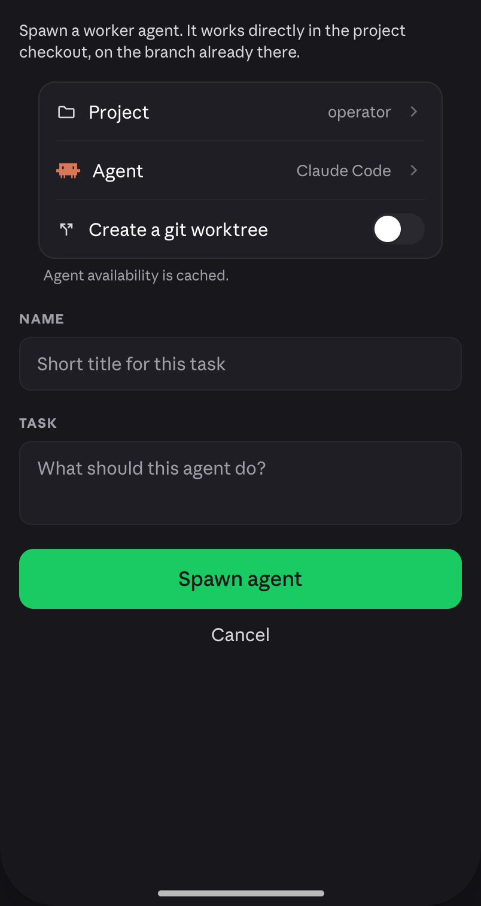
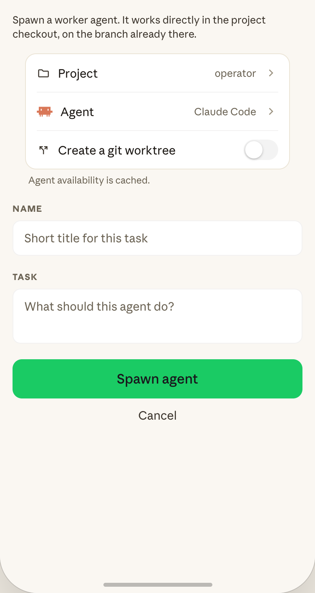

# Spawn agent screen

 

Shared docs: [`../colors.md`](../colors.md) · [`../typography.md`](../typography.md) ·
[`../motion.md`](../motion.md) · [`../components.md`](../components.md) ·
[`../README.md`](../README.md) (screen→feature map, global conventions).

## Part A — Spec

### Purpose / context

Opened via a persistent FAB on the Agents tab (`S.fab`, bottom-right, present in EVERY
board state — loading/empty/loaded — not just the empty state's inline "Spawn agent"
button, which is a second, separate entry point to the same screen). Owned by the `spawn`
feature even though `sessions` launches it (launcher-vs-owner, per README). Full-screen
form, no bottom-nav bar visible while open (it's a pushed screen, not a tab).

### Layout tree (top → bottom)

1. **Sub-appbar** (`S.appbarSub`): `bgChrome` bg, `borderSubtle` bottom border, min-height
   56, padding `0 10px`. Back chevron (`arrow_back_ios_new`, `backBtn` 32×32 tap target,
   `textPrimary`), centered title "Spawn agent" (`subTitleCenter` — `style16SemiBold`,
   `textAlign:center`, `marginRight:32` to visually re-center against the back button).
2. **Scrollable body** (`S.spawnScroll`, padding 16):
   - Intro paragraph (`S.spawnIntro` — `style13Regular`/`textSecondary`, line-height 1.4,
     margin-bottom 16). **Dynamic, verbatim per state** (see "Verified behaviors" below for
     the exact 3 strings — this is real conditional copy, not filler).
   - **Settings-style group card** (reuses the same `SettingsGroup` visual pattern as
     Settings — `bgSurface`/`radiusCard`/`borderDefault`):
     - "Project" row (`folder` icon, label "Project", value = current project name, e.g.
       "operator", chevron) — tapping **cycles** through a fixed 3-project list (does NOT
       open a picker sheet in the mockup — verified: `cycleProject` mutates an index
       directly). Flag to the user whether the real build should keep this cycle-on-tap
       behavior or upgrade to `project_picker_sheet.dart` (already exists, restyled) for
       a real (larger, live) project list — the mockup's 3-item cycle is clearly a demo
       stand-in, not a considered interaction choice.
     - `rowDivider`.
     - "Agent" row: a 20×20 agent logo image (`spawnAgentLogo`, `radiusXs` corners) instead
       of a Material icon, label "Agent", value "Claude Code" (verbatim, hardcoded — no
       cycle handler attached in source), chevron. Chevron present but inert in the mockup;
       this repo already supports multiple harnesses (`claude-code`, `cursor`, `codex`,
       etc. per the sessions board's dummy data) — flag whether this row should open
       `agent_picker_sheet.dart` (already exists, restyled) for real harness selection,
       since a non-functional chevron would be a regression from what this app can already
       do elsewhere.
     - **Conditional** `rowDivider` + "Create a git worktree" row — **only rendered when
       the selected project is single-repo** (verified: gated on `spawn.isSingleRepo`,
       i.e. `projectKinds` entries tagged `kind:'single_repo'` vs `'multi_repo'`). Icon
       `call_split`, label, trailing Switch (`trackStyle`/`thumbStyle` — same switch spec
       as Settings' notification toggle: `accent`/`bgSubtle` track, white thumb, 180ms
       spring). This directly maps to this app's real "optional session worktree" feature
       (see this repo's git history — a `git worktree` toggle already exists per recent
       work) — cite/reuse that existing cubit/model field rather than inventing a new one.
   - Footer: "Agent availability is cached." (`groupFooter` styling).
   - "NAME" field label (`S.fieldLabel` — `style11Bold`/`textTertiary`, letter-spacing 1,
     margin `20px 0 8px`, uppercase) + single-line text field (`S.textField` —
     `style15Regular`/`textTertiary` placeholder color, `bgSurface` fill, `borderSubtle`
     1px border, `radiusLg` 10px, padding `12px 14px`) with placeholder "Short title for
     this task".
   - "TASK" field label + multi-line text field (`S.textFieldTall` — same styling,
     `minHeight:70`) with placeholder "What should this agent do?".
   - Primary button "Spawn agent" (`S.spawnPrimaryBtn` — height 50, `radiusButton` 12,
     `accent` bg, `onAccent` text, `style17Medium`, margin-top 20, press scale
     `pressScaleDefault` + `AppMotion.spring`).
   - "Cancel" text button (`S.spawnCancel` — `style15Regular`/`textSecondary`, centered,
     padding `12px 0`) — navigates back to the Agents tab (`goHome` handler).

### Verified behaviors — intro copy is a real 3-state conditional, not decoration

The intro paragraph text is computed from project kind + worktree toggle (verbatim from
source, port exactly):
- Multi-repo project selected: *"Spawn a worker agent. It gets its own isolated workspace,
  then starts on the task you give it."*
- Single-repo project + worktree toggle ON: *"Spawn a worker agent. It gets its own
  isolated worktree, then starts on the task you give it."*
- Single-repo project + worktree toggle OFF (default, shown in both PNGs): *"Spawn a worker
  agent. It works directly in the project checkout, on the branch already there."*

Dummy project list (verbatim, `projectKinds` in source): `operator` (single_repo, shown by
default in both PNGs), `operator-web` (single_repo), `billing-service` (multi_repo — cycling
to this one hides the worktree row and swaps in the first intro string above).

### Motion

Standard fade-up screen entrance. Toggle thumb slides 180ms spring (`AppMotion.spring`).
Primary/cancel press feedback per `components.md`'s `PrimaryButton`/`PressScale` specs. No
sheets/dialogs owned by this screen (see below).

### Flutter mapping

`lib/feature/spawn/presentation/spawn_screen/`.

## Sheets & dialogs owned by this screen

None in the mockup as shipped — but see the two flagged judgment calls above (Project row
possibly upgrading to `project_picker_sheet.dart`, Agent row possibly to
`agent_picker_sheet.dart`). If the user confirms either upgrade, that sheet is already
built (Phase 5) — wire it in rather than building new, and add a short subsection here
after the decision is made.

## Part B — Implementation brief

**TASK:** Build/restyle the Spawn screen to the new design system. Phase scope: real form
wiring where this screen's cubit already exists — check first — otherwise UI-only with the
dummy data above; do not build actual agent-spawn networking if it doesn't already exist.

**Do this FIRST, before any Dart:** (a) read `docs/design/README.md` (screen→feature map,
global conventions); (b) invoke the `flutter-knowledge` skill — authority on this project's
cubit/screen/body/DI conventions. Only then read Part A above, the two PNGs, and the four
shared docs.

**Target feature — exact path (non-negotiable):**
`lib/feature/spawn/presentation/spawn_screen/`. Every file for this screen goes here, not
`sessions` (which only launches it).

**Already exists — do NOT recreate:** Read `lib/feature/spawn/presentation/spawn_screen/`
fully first — a real cubit/form likely already exists (project selection, agent/harness
selection, worktree toggle, name/task fields, submit). Also already exists:
`SettingsGroup`/row (Phase 5, restyled — reuse for the Project/Agent/worktree card),
`PrimaryButton` (Phase 5), `project_picker_sheet.dart` / `agent_picker_sheet.dart` (Phase
5, restyled, currently unused by this screen per the mockup's cycle-on-tap behavior — see
judgment calls).

**Files to create/change:** Only this screen's own `ui/spawn_screen.dart` + any small
feature widgets for the settings-style card rows, name/task fields (reuse
`AppTextField`/`SettingsGroup` from core, don't rebuild).

**Key implementation points:**
1. Resolve BOTH judgment calls above with the user before finalizing interaction (Project
   cycle-vs-sheet, Agent inert-chevron-vs-sheet) — the mockup under-specifies both and a
   literal port would be a functionality regression from what this app's core widgets
   already support elsewhere.
2. Worktree row visibility must be driven by the SAME single-repo/multi-repo signal this
   app already uses elsewhere (cite the existing model field from the recent "optional
   session worktree" work — do not reintroduce a parallel `isSingleRepo` concept).
3. Intro copy must stay a live computed string (3 variants above), not a static label.
4. NAME/TASK are required before "Spawn agent" is enabled/functional — verify against
   this screen's actual cubit validation if one exists; the mockup shows no explicit
   disabled-button state, so don't invent one without checking the real validation rules.

**Dummy data:** See "Verified behaviors" above for the exact `projectKinds` array and intro
strings, if the real project list isn't already live-wired here.

**Localization:** This repo's CLAUDE.md — **no LocaleKeys / easy_localization**, inline
English copy only.

**Definition of done:** `flutter analyze` clean; matches both PNGs in light/dark for the
default (operator, worktree off) state; worktree row correctly hides for multi-repo
projects; both judgment calls resolved with the user, not silently decided; no new
`flutter test` failures.
